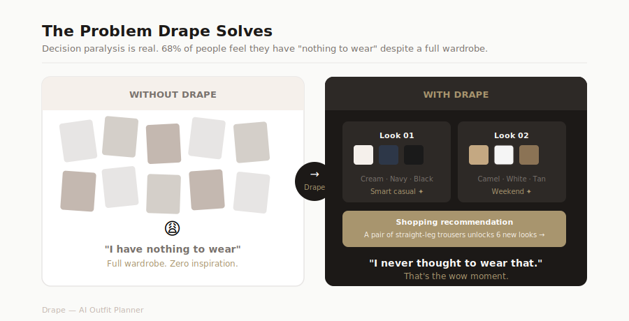
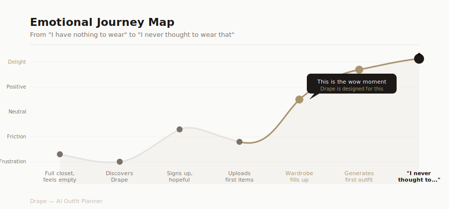
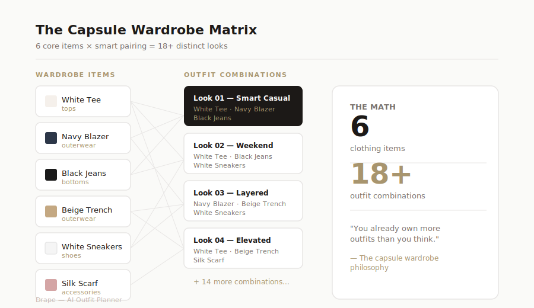
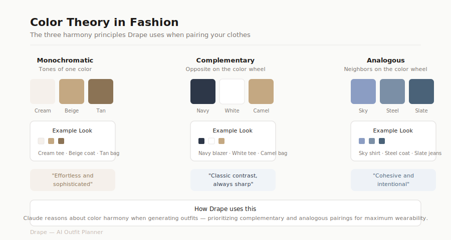
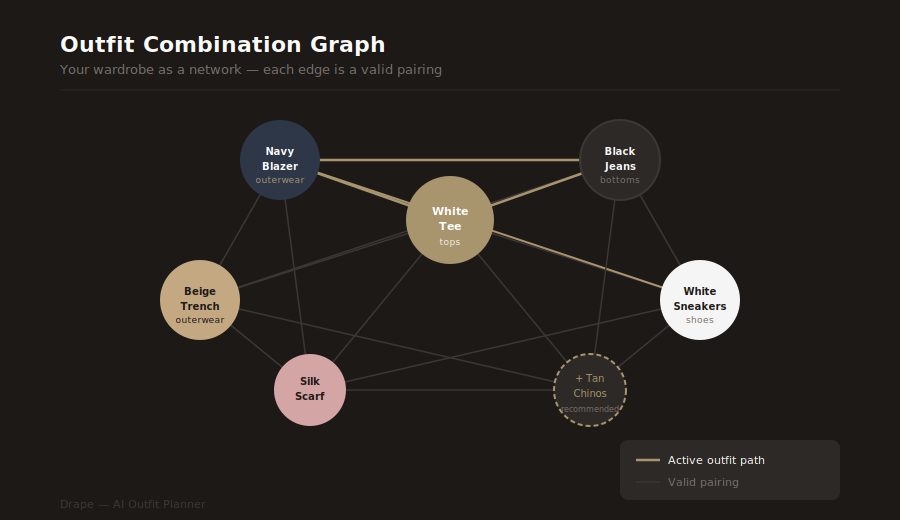
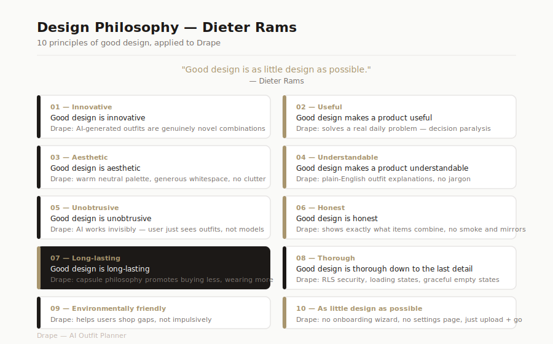
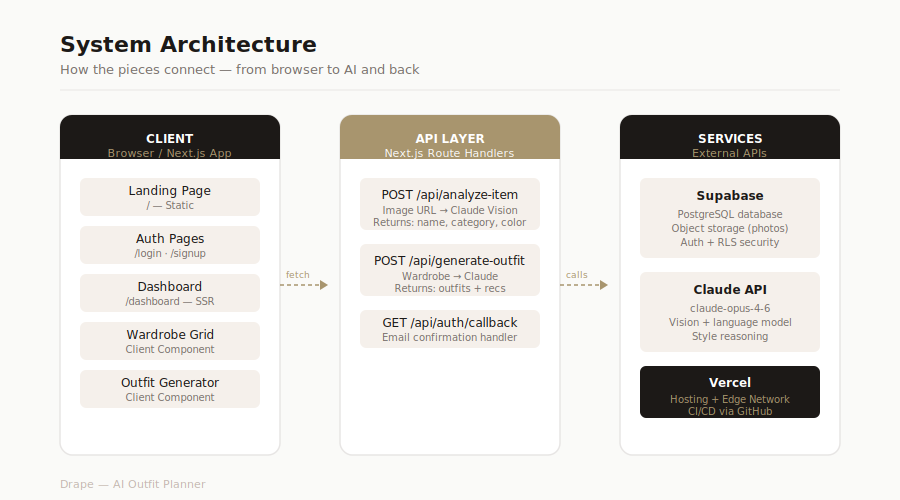
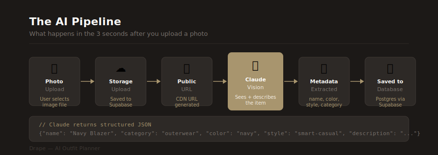
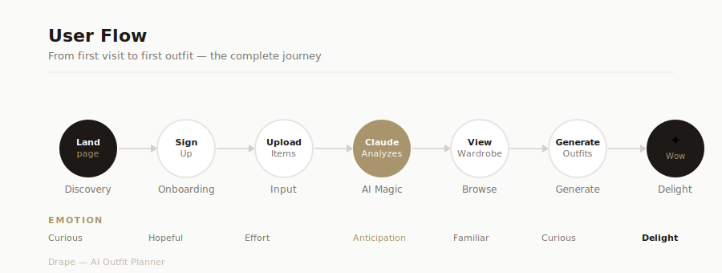
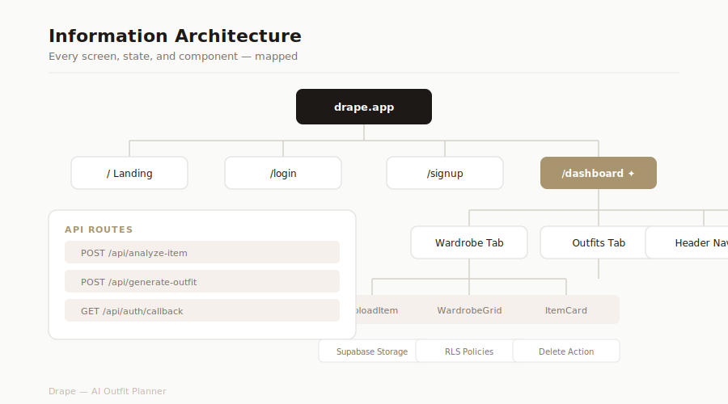

# Drape

**Your AI stylist. Upload your wardrobe — get outfits you'd never think to wear.**

Drape solves decision paralysis by turning a photo library of your clothes into personalized outfit combinations, powered by Claude Vision. No more staring at a full closet feeling like you have nothing to wear.

[Live Demo](#) · [Report a Bug](https://github.com/antoinette-nguyen/drape/issues)

---

## Screens

### Landing
```
┌─────────────────────────────────────────┐
│                                         │
│                                         │
│              Drape                      │
│                                         │
│   Upload your wardrobe. Let AI build    │
│   outfits you've never thought to wear. │
│                                         │
│         [ Log in ]  [ Get started ]     │
│                                         │
│                                         │
└─────────────────────────────────────────┘
```

### Wardrobe
```
┌─────────────────────────────────────────────────────────┐
│  Drape                          hello@you.com  Sign out  │
├─────────────────────────────────────────────────────────┤
│  Wardrobe (12)    Outfits                               │
├─────────────────────────────────────────────────────────┤
│                                                         │
│  Your wardrobe                          [ + Add item ]  │
│  Upload photos of your clothing items                   │
│                                                         │
│  ┌────────┐ ┌────────┐ ┌────────┐ ┌────────┐           │
│  │  img   │ │  img   │ │  img   │ │  img   │           │
│  │        │ │        │ │        │ │        │           │
│  ├────────┤ ├────────┤ ├────────┤ ├────────┤           │
│  │White   │ │Navy    │ │Black   │ │Beige   │           │
│  │tee     │ │blazer  │ │jeans   │ │coat    │           │
│  │tops •  │ │outer • │ │bottoms │ │outer • │           │
│  │white   │ │navy    │ │• black │ │beige   │           │
│  └────────┘ └────────┘ └────────┘ └────────┘           │
│                                                         │
└─────────────────────────────────────────────────────────┘
```

### Outfit Generator
```
┌─────────────────────────────────────────────────────────┐
│  Drape                          hello@you.com  Sign out  │
├─────────────────────────────────────────────────────────┤
│  Wardrobe (12)    Outfits                               │
├─────────────────────────────────────────────────────────┤
│                                                         │
│  Outfit suggestions             [ Generate outfits ]    │
│  AI-generated combinations from your wardrobe           │
│                                                         │
│  ┌───────────────────────────────────────────────────┐  │
│  │  LOOK 1                                           │  │
│  │  ┌──────┐  ┌──────┐  ┌──────┐                   │  │
│  │  │ img  │  │ img  │  │ img  │                   │  │
│  │  └──────┘  └──────┘  └──────┘                   │  │
│  │  White tee  Navy blazer  Black jeans             │  │
│  │                                                   │  │
│  │  The blazer elevates the basic tee into smart-   │  │
│  │  casual territory. Works for a client meeting    │  │
│  │  or a dinner where you want to look intentional. │  │
│  └───────────────────────────────────────────────────┘  │
│                                                         │
│  ┌───────────────────────────────────────────────────┐  │
│  │  WHAT TO SHOP NEXT                                │  │
│  │  You own strong tops and outerwear but lack       │  │
│  │  versatile trousers. A pair of straight-leg tan   │  │
│  │  chinos would unlock 6 new outfit combinations.   │  │
│  └───────────────────────────────────────────────────┘  │
│                                                         │
└─────────────────────────────────────────────────────────┘
```

---

## Design & Research

### The Problem


### Emotional Journey Map


### Capsule Wardrobe Matrix


### Color Theory


### Outfit Combination Graph


### Design Philosophy — Dieter Rams


---

## Technical Design

### System Architecture


### The AI Pipeline


### User Flow


### Information Architecture


---

## Features

- **Wardrobe upload** — photograph a clothing item, Claude Vision identifies the name, category, color, and style automatically
- **Smart grid** — all your items in one place, organized and deletable
- **Outfit generator** — Claude assembles combinations you haven't tried, with a plain-English explanation of why each look works
- **Shopping recommendations** — gap analysis on your wardrobe; tells you exactly what one purchase would unlock the most outfits

---

## Tech Stack

| Layer | Choice | Why |
|---|---|---|
| Framework | Next.js 16 (App Router) | Fullstack, deploys to Vercel in one click |
| Database + Auth + Storage | Supabase | One platform for everything; RLS ensures users only see their own data |
| AI | Claude API (claude-opus-4-6) | Vision + language in one model; best at nuanced style reasoning |
| UI | Tailwind CSS + shadcn/ui | Polished components without design overhead |

---

## Running locally

**Prerequisites:** Node.js 18+, a Supabase project, an Anthropic API key

```bash
git clone https://github.com/antoinette-nguyen/drape.git
cd drape
npm install
```

Copy the environment template and fill in your keys:

```bash
cp .env.local.example .env.local
```

```env
NEXT_PUBLIC_SUPABASE_URL=your_supabase_project_url
NEXT_PUBLIC_SUPABASE_ANON_KEY=your_supabase_anon_key
ANTHROPIC_API_KEY=your_anthropic_api_key
```

Run the database schema in your Supabase SQL editor:

```bash
# Copy contents of supabase-schema.sql into Supabase → SQL Editor → Run
```

Start the dev server:

```bash
npm run dev
```

Open [http://localhost:3000](http://localhost:3000).

---

## Project structure

```
src/
├── app/
│   ├── page.tsx                  # Landing page
│   ├── login/                    # Auth
│   ├── signup/
│   ├── dashboard/                # Main app (wardrobe + outfits)
│   └── api/
│       ├── analyze-item/         # Claude Vision → item metadata
│       ├── generate-outfit/      # Claude → outfit combos + shopping recs
│       └── auth/callback/        # Supabase email confirmation handler
├── components/
│   ├── wardrobe/
│   │   ├── UploadItem.tsx        # Upload → storage → analyze → save
│   │   └── WardrobeGrid.tsx      # Photo grid with delete
│   └── outfits/
│       └── OutfitGenerator.tsx   # Generate + display outfits
└── lib/
    ├── supabase.ts               # Browser client
    └── supabase-server.ts        # Server client (for SSR)
```

---

## Deploying to Vercel

1. Push to GitHub
2. Import the repo at [vercel.com/new](https://vercel.com/new)
3. Add environment variables in Vercel project settings
4. Deploy

---

Built by [Antoinette Nguyen](https://github.com/antoinette-nguyen)
